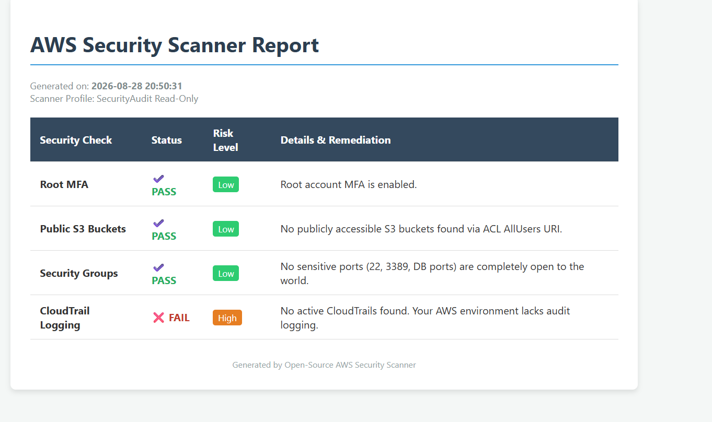

# AWS Security Scanner 🛡️


A lightweight, open-source Python tool that performs a quick security posture
assessment of an AWS account and generates a clean, shareable HTML report —
built entirely on AWS Free Tier API calls, with zero cost to run.

## 📸 Sample Report



## What It Checks

| Check | What It Looks For |
|---|---|
| **Root Account MFA** | Whether MFA is enabled on the root AWS account |
| **Public S3 Buckets** | Buckets exposed via ACL `AllUsers` grants or missing Public Access Block |
| **Security Groups** | Sensitive ports (22, 3389, 3306, 5432, 27017) open to `0.0.0.0/0` |
| **CloudTrail Logging** | Whether audit logging is active in the account |

Each check returns a **PASS / FAIL / ERROR** status, a **risk level**
(Low / High / Critical), and plain-language remediation guidance — all
rendered into a single HTML report.

## Security Design

- **Read-only by design** — intended to run with the AWS-managed
  `SecurityAudit` policy attached to an IAM user. The tool never modifies,
  creates, or deletes any AWS resource.
- **Cost-free** — every API call used falls within AWS Free Tier limits.
- **No hardcoded credentials** — relies entirely on the AWS CLI credential
  chain (`aws configure`), never stores keys in code.

## Setup (Windows 11 / PowerShell)

```powershell
# 1. Clone the repo
git clone https://github.com/NaeemAkmal/aws-security-scanner.git
cd aws-security-scanner

# 2. Create and activate a virtual environment
python -m venv venv
.\venv\Scripts\Activate
# If you hit an execution policy error:
# Set-ExecutionPolicy Unrestricted -Scope CurrentUser

# 3. Install dependencies
pip install -r requirements.txt

# 4. Configure AWS CLI with a READ-ONLY IAM user (SecurityAudit policy only)
aws configure

# 5. Run the scanner
python scanner.py
```

## Expected Output

```
[*] Starting AWS Security Scanner...
[*] Running Check 1: Root Account MFA...
[*] Running Check 2: Public S3 Buckets...
[*] Running Check 3: Open Security Groups...
[*] Running Check 4: CloudTrail Logging Status...
[*] All checks completed. Generating report...
[+] Security report successfully generated at:
    C:\path\to\aws-security-scanner\security_report.html
```

Open `security_report.html` in any browser to view the results.

## Tech Stack

- **Python 3.9+**
- **boto3** — AWS SDK for Python
- **Jinja2** — HTML report templating

## Project Structure

```
aws-security-scanner/
├── checks/
│   ├── mfa_check.py
│   ├── s3_check.py
│   ├── sg_check.py
│   └── cloudtrail_check.py
├── report/
│   ├── generate_report.py
│   └── template.html
├── assets/
│   └── sample_report_screenshot.png
├── scanner.py
├── requirements.txt
└── README.md
```

## Roadmap (Phase 2)

- Additional checks: IAM password policy, unused access keys, EBS/RDS
  encryption status
- Multi-region scanning
- Slack/email alerting on FAIL results
- Auto-remediation suggestions with one-click IAM policy generation

## Author

**Naeem Akmal** — Cybersecurity Researcher | CEH | Cloud Security (in progress)
[GitHub](https://github.com/NaeemAkmal) · [LinkedIn](https://linkedin.com/in/naeemakmal15)

## Disclaimer

This tool is for educational and defensive security auditing purposes on
AWS accounts you own or are authorized to assess. Always rotate any
credentials exposed during setup or testing.
